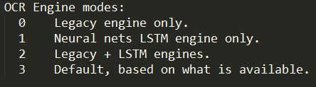
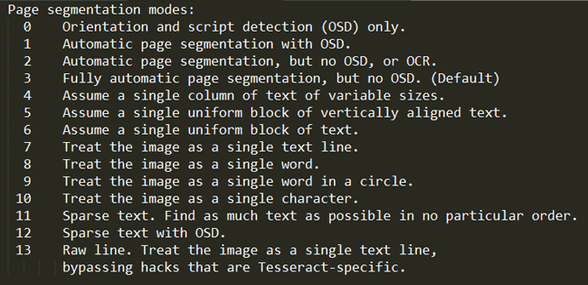

# Vehicle-Number-Plate-Detection

The dataset considered is of Indian Number Plates in the form of a JSON file. The file consists of links for each vehicle image including the coordinates of the number plate in the image.
The main purpose of this project is to extarct the number plates from the images and recognise the text on the number plates.

## Dependencies:
#### Python3 pytesseract Tesseract 4 OpenCV PILLOW urllib 
## Flow of project:

Step 1: Extract license plates from the images.  
Step 2: Preprocessing  
&nbsp;&nbsp;&nbsp;&nbsp;&nbsp;&nbsp;&nbsp;&nbsp;&nbsp;&nbsp;&nbsp;&nbsp;&nbsp;1. Noise Reduction  
&nbsp;&nbsp;&nbsp;&nbsp;&nbsp;&nbsp;&nbsp;&nbsp;&nbsp;&nbsp;&nbsp;&nbsp;&nbsp;2. Binarization  
Step 3: Optical Character Segmentation using Google Tesseract

### Number Plates Extraction 
-> urllib library in Python is used to open the image urls from the parsed json file. 
-> The coordinates in the json file are used to crop the vehicle number plates and are saved. 
### Preprocessing  
The preprocessing and optical character recognition using tesseract are performed together for every image.  
-> The first step of preprocessing converts the input image into a grayscale image using OpenCV. 
-> Gaussian Blur filter is used on the grayscale image as a low-pass filter to remove high-frequency components. 
-> Image thresholding using binary threshold technique and Otsu's Binarization technique are applied on the filtered image to partition it into foreground and background. 

### Tesseract OCR  
-> pytesseract module in Python is used to apply Google tesseract on the image data for optical character recognition.  
-> The configurations of the tesseract model is very important to improve the accuracy of the model. 
#### The tesseract config include: 
##### language flag (-l)  
Set it to a language used in the images. For example, for English it will be <em>-l eng </em>  
##### OCR Engine Mode (--oem)  
It has four different modes. Each mode uses a different algorithm to recognize the characters from the Image. By default it uses the algorithm that got installed with the package. But we can change it to use LSTM or Neural nets. The four different Engine modes is shown below. The flag is indicated by --oem, so to set it to mode 1, simply use <em>-- oem 1.</em> 

 
##### Page Segmentation Flag (--psm) 
These are very useful when your image has so much background details along with the characters or the characters are written in different orientation or size. There are totally 14 different page segmentation mode, all of them are listed below. The flag is indicated by –psm, so to set the mode of 11. It will be <em>–psm 11.</em> 
 
